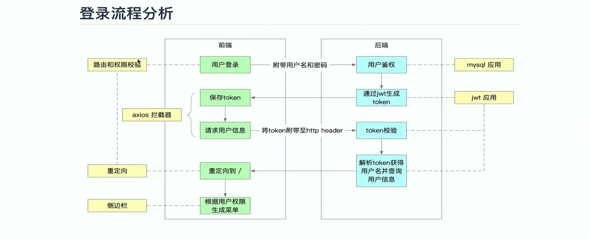
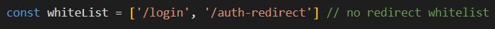
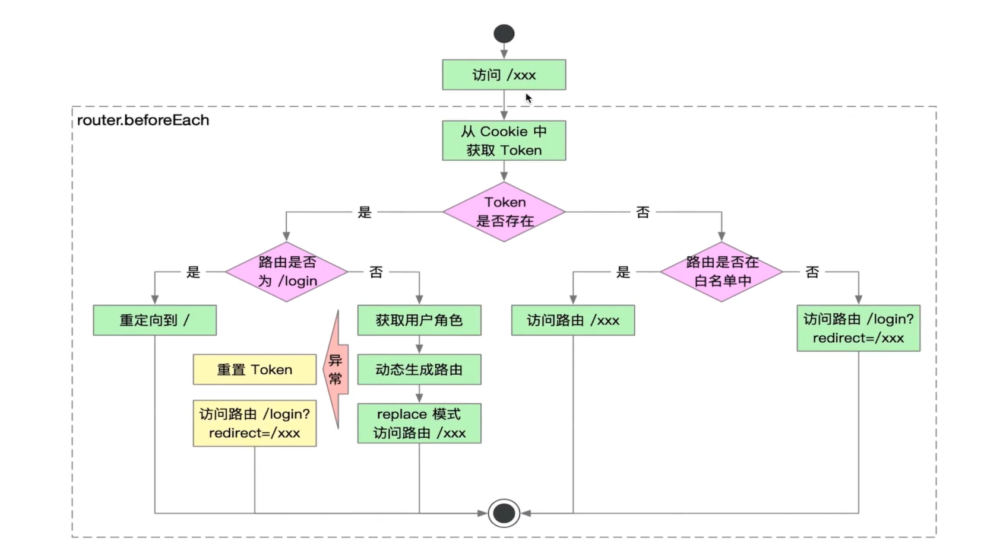
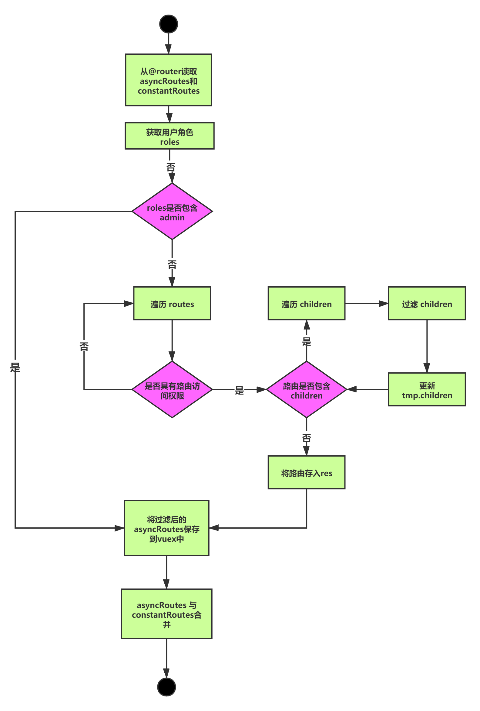

<!-- 安装插件
 Markdown All in One
 Markdown Preview Enhanced
 Markdown Shortcuts
 markdown pdf
 markdown toc
简介：这个插件是用来生成目录
配置：
markdown-toc.depthFrom: 生成目录的标题最低级别，默认h1
markdown-toc.depthTo: 生成目录的标题最高级别，默认h6
markdown-toc.insertAnchor: 自动插入链接地址，默认false
markdown-toc.withLinks: 自动插入链接，默认true
markdown-toc.updateOnSave: 自动更新

常用快捷键
column0	column1
Key	Command
**Ctrl + B	粗体**
_Ctrl + I	斜体_
~~Alt + S	删除线~~
# Ctrl + Shift + ]	标题(uplevel)
Ctrl + Shift + [	标题(downlevel)
Ctrl + M	Toggle math environment
Alt + C	Check/Uncheck task list item 
ctrl+k v: 这个意思是先同时按住ctrl和k键，放开后再按一个v键

2. 使用技巧总结(MarkDown语法)
2.1. 标题设置（:后面需要空格）
几级标题需要使用多少个‘#’。

2.2. 段落or换行
使用空行隔开自动形成段落
在结束处使用2个空格键即可
2.3. 简单字体设置
粗体：安装完插件后，使用ctrl+b设置选中的文字，或者使用代码在** **，在之间的空格处插入文字。
斜体：使用ctrl+i，可以设置斜体，在两个‘*’之间设置。
下划线：左右个2个++即可

2.4. 引用
使用“> “，即可。

2.5. 分割线
使用三个"***"，或者

2.6. 页眉分割线
使用三个"-"就可以设置页眉分割线

2.7. 插入图片
图片的插入比较负责可以使用"![]（）“这个是比较负责的在之间插入本地图片的地址
-->

# 开发笔记

---

## 用户登录

* ### 登录流程分析

    **_前端_**：用户登录界面->输入用户名和密码->点击登录————>**后端**：用户授权模块->mysql数据库中校验用户名和密码是否正确->正确之后->通过jwt生成token->将token返回给前端->前端保存token->之后请求用户信息的时候->会将token附带在http header中->传给后端->后端拿到数据->进行token校验->校验成功->会解析token获得用户名并查询用户信息->然后将用户信息返回给前端->前端拿到信息->会去做一个路由的认证->重定向到/根路径->根据用户权限生成菜单
    

* ### 路由和权限校验
  
  首先，我们访问一个路由，假定我们访问的路由是/login，可以看见在这个项目中（vue-element-admin)框架定义了一个全局的路由守卫，所有经过这个路由的都需要访问这个方法。
  **_那这个方法具体做了哪些事情？_**
  首先它从cookie中获取token，判断token是否存在，其实我们第一次访问login的时候，token是不存在的，然后没有token会进入到否这个环节
  <h5 style="color:red">token不存在</h5>
  在这个环节，它首先会判断路由是否在白名单中，如果在白名单中，他就可以直接访问，我们的login就是在白名单中的。访问到路由的时候，在界面上就会做一个事情，把app.vue里的\<_**router-view**_/>替换为我们的login组件。如果我们访问的路由不在白名单中，那么我们实际访问的路由会是/login?redirect=/xxx，即在登录之后会被重定向到这个路由中。以上即为token不存在的情况.

  <h5 style="color:green">token存在</h5>

  这时候有token（已登录过）还访问login，会走到左边token存在这个分支。token存在的时候，他会做一个校验，路由是否为/login？如果是，那么它会重定向到根路径下（/），而根路径对应的就是项目里的deshboard。如果不是/login那么它就会根据token获取角色信息，生成动态路由，去做权限校验和匹配。如果匹配到这个路由，它会通过replace模式来访问这个路由。如果在右边这些过程中任何一步发生异常，就会进入异常处理逻辑（使用try catch）。异常处理逻辑主要有两步，第一：重置token；第二：访问/login，其实就是回到登录页面。


* ##### 路由实现
  
  下面这个是一个纯样式，表示在页面加载时在页面顶部显示的加载页面进度条，因为是纯样式，所以需要手动调用start和done方法进行控制
  ```js
    // 开启进度条
    NProgress.start()
    // 关闭进度条
    NProgress.done()
  ```
  首先，可以看见在main.js里面，引入了permission这个文件
  ```js
    import './permission' // permission control
  ```
  打开这个文件，里面设置了全局路由守卫，注意最后路由访问的时候一定要去调用这个next()回调，不然这个路由是访问不到的。
  permission.js
  ```js
    router.beforeEach(async(to, from, next) => {
    // 开启进度条
        NProgress.start()

        // 根据配置项更改标题（meta里的title属性）
        document.title = getPageTitle(to.meta.title)

        //去cook中获取token
        const hasToken = getToken()

        if (hasToken) {
            if (to.path === '/login') {
                // 如果已登录，请重定向到主页
                next({ path: '/' })
                NProgress.done()
            } else {
                // 确定用户是否已通过getInfo获得其权限角色
                const hasRoles = store.getters.roles && store.getters.roles.length > 0
                if (hasRoles) {
                next()
            } else {
                try {
                    // 获取用户信息
                    //注意：角色必须是对象数组！ 例如：['admin']或，['developer'，'editor']
                    const { roles } = await store.dispatch('user/getInfo')

                    // 根据角色生成可访问的路由表
                    const accessRoutes = await store.dispatch('permission/generateRoutes', roles)

                    // 动态添加可访问的路由
                    // 根据路由表生成菜单栏
                    router.addRoutes(accessRoutes)

                    // hack方法，以确保addRoutes是完整的
                    // 设置replace：true，因此导航将不会留下历史记录，具体表现为从登陆页面进入到主页后，回退是不会退回到登录页面的
                    next({ ...to, replace: true })
                } catch (error) {
                    // 删除token并进入登录页面重新登录
                    await store.dispatch('user/resetToken')
                    // 这里这个resetToken就是清除token的接口
                    Message.error(error || 'Has Error')
                    next(`/login?redirect=${to.path}`)
                    NProgress.done()
                }
            }
        } else {
            /* 没有token*/
            if (whiteList.indexOf(to.path) !== -1) {
                // 看白名单中是否有这个路由，有就直接找重定向访问这个路由
                next()
            } else {
                // 其他无权访问的页面将被重定向到登录页面
                next(`/login?redirect=${to.path}`)
                NProgress.done()
            }
        }
    })
  ```
* ##### 动态路由实现流程
  动态路由生成逻辑如下图
  
    #### 逻辑分析
        首先需要将asyncRoutes和constantRoute读取到，然后获取用户的角色，比如你是admin或者其他什么的。然后做一个判断，你的roles（角色）是否是admin？如果是admin就会直接将asyncRoutes保存到vuex中。并且将2个路由进行合并。这说明如果你是admin权限，将会跳过所有的路由的判断，将所有的菜单进行加载。如果不是admin权限，它将会去遍历所有的routes，取出每个routers进行判断。判断当前这个权限是否具有路由访问的权限。如果没有会遍历下一个，如果有，会进入下一步判断，判断路由当中是否存在子路由。如果存在子路由，会采用迭代的方法进行子路由的一个遍历，子路由当中会进行过滤，过滤完后会对当前这个children进行更新，其实就是将不符合条件的子路由剔除掉。最后当判断完成之后，把路由存入到一个新的数组当中，把这个新的数组替换原来这个asyncRoutes，然后存入vuex。最后将asyncRoutes和constantRoutes进行合并。

    ##### 源码实现
        生成路由是在这里的generateRoutes这个方法里面，它位于store/modules/permission.js里。这里这个方法其实就是上面提到的2个步骤，第一就是判断当中是否包含admin，只要包含admin，比如说你可能有editor权限，admin权限都有，但是只要你包含了admin，那么asyncRoutes就会直接赋给这里的accessedRoutes，accessedRoutes拿到之后会将其调用SET_ROUTES（即给vuex里的routes），保存我们的state当中的addRoutes。然后会把我们state下面的routes和constantRoutes调用concat方法和新的routes进行合并，合并完成之后放到state里的routes下。所以在主页生成sidebar（左侧侧边栏）的时候，是根据这里的routes进行的，而这个addRoutes是作为一个保存用的。以上是admin权限的一个逻辑。
        如果没有admin权限，将会走到filterAsyncRoutes这个方法里去，他会对routes进行一个遍历，使用const tmp = { ...route }对routes进行一个浅拷贝，拷贝到新的一个tmp里面。然后去做hasPermission的一个校验（校验是否具有权限）。hasPermission源码主要是做2个判断，第一个判断是去找传入的这个路由是否具有meta这个信息，如果没写meta或者meta下面没有roles这个属性，将直接返回true，返回true意味着有权限。这就说明，如果你没有定义权限，那么这个校验就视为你对这个路由有访问权限，因为这里没有配置那些人可以访问，那就默认谁都可以访问。如果说我们定义了这个meta，meta里面有roles，那么他就和我们router目录下的路由情况命中
    ```js
        {
            path: '/book',
            component: Layout,
            redirect: '/book/create',
            meta: { title: '图书管理', icon: 'doucumentation', roles: ['admin'] },
            children: [
            {
                path: '/book/create',
                component: () => import('@/views/book/create'),
                meta: { title: '上传图书', icon: 'edit', roles: ['admin'] }
            }
            ]
        },
    ```

        然后他就会做一个判断，判断hasPermission方法里的routes，其实就是route里的这句话meta: { title: '上传图书', icon: 'edit', roles: ['admin']里的这个数组，进行some判断，some就是命中数组里的一条，即为true，会把下面的routes进行权限检查，回去找我们写好在路由里的数组权限，看这个数组是否包含这里的roles。也就是说只要你这些roles和在路由里定义好的权限数组有一个匹配，就会返回一个true，即认为有权限。
        当判断hasPermission通过的时候，才能进行下一步的操作，他会去找是否有children，就是当前这个路由是否有子路由，因为它需要判断你是否有访问下一级路由的权限，所以他会被子菜单迭代调用自身（filterAsyncRoutes），它会把子路由依次传入，再进行判断，判断的结果会来更新这里的tmp.children，更新完之后把整个tmp赋给res，最后把res返回，返回之后替换掉generateRoutes里的accessedRoutes，赋到‘SET_ROUTES’再将其和constantRoutes结合在一起。如果没有通过，即不能访问的权限，那后面的操作也就不执行了，直接进入下一个迭代。

    ```js

        function hasPermission(roles, route) {
            if (route.meta && route.meta.roles) {
                return roles.some(role => route.meta.roles.includes(role))
            } else {
                return true
            }
        }

        export function filterAsyncRoutes(routes, roles) {
            const res = []

            routes.forEach(route => {
                const tmp = { ...route }
                if (hasPermission(roles, tmp)) {
                if (tmp.children) {
                    tmp.children = filterAsyncRoutes(tmp.children, roles)
                }
                res.push(tmp)
                }
            })

            return res
        }

        const state = {
            routes: [],
            addRoutes: []
            }

            const mutations = {
            SET_ROUTES: (state, routes) => {
                state.addRoutes = routes
                state.routes = constantRoutes.concat(routes)
            }
        }

        const actions = {
            generateRoutes({ commit }, roles) {
                return new Promise(resolve => {
                let accessedRoutes
                if (roles.includes('admin')) {
                    accessedRoutes = asyncRoutes || []
                } else {
                    accessedRoutes = filterAsyncRoutes(asyncRoutes, roles)
                }
                commit('SET_ROUTES', accessedRoutes)
                resolve(accessedRoutes)
                })
            }
        }
    ```
    ### 总结
    #### 关于路由处理
    * vue-element-admin 对所有访问的路由进行拦截
    * 访问路由时会从Cookie中获取Token，判断Token是否存在：
        * 如果token存在，将根据用户角色生成动态路由，然后访问路由，生成对应的页面组件。这里有一个特例就是用户访问 /login 时会重定向到 / 路由；
        * 如果token不存在，则会判断路由是否在白名单中，如果在白名单中则直接访问，否则说明该路由需要登陆才能访问，此时会将路由生成一个 redirect 参数传入 login 组件，实际访问的路由就变为： /login?redirect=xxxx

    #### 关于动态路由和权限校验
    * vue-element-admin 将路由分为：constantRoutes和 asyncRoutes
    * 用户登录系统时，会动态生成路由，其中 constantRoutes必然包含，asyncRoutes 会进行过滤；
    * asyncRoutes过滤的逻辑是看路由下是否包meta和meta.roles属性，如果没有该属性，那么这是一个通用路由，不需要进行权限校验；如果包含roles属性则会判断用户的角色是否命中路由中的任意一个权限，如果命中，则将路由保存下来，如果未命中，则将该路由舍弃；
    * asyncRoutes处理完毕之后，会和constantRoutes进行合并为一个新的路由对象，并保存到vuex的permission/routes中；
    * 用户登录之后，侧边栏会从vuex中获取state.permission.routes，根据该路由动态渲染用户菜单。


***

* ## 侧边栏
  ### 源码位置
  * sidedar引用layout组件，layout组件位于 src/layout/index.vue
  * sidebar组件源码位于 src/layout/conmponents/sidebar/index.vue

  ### el-menu用法解析
    侧边栏的核心是将根据权限过滤后的router和el-menu组件进行映射，所以熟悉el-menu是理解sidebar的起点

    ```html
         <!--  -->
        <template>
            <el-row class="tac">
                <el-col :span="12">
                <el-menu
                    default-active="1-1"
                    background-color="#545111"
                    text-color="#fff"
                    active-text-color="#ffd0cc"
                    mode="vertical"
                    unique-opened
                    :collapse="isCollapse"
                    :collapse-transition="false"
                    class="el-menu-vertical-demo"
                    @open="handleOpen"
                    @close="handleClose"
                    @select="handleSelect"
                >
                    <el-submenu index="1">
                    <template slot="title">
                        <i class="el-icon-location" />
                        <span>导航一</span>
                    </template>
                    <el-menu-item-group>
                        <template slot="title">分组一</template>
                        <el-menu-item index="1-1">选项1-1</el-menu-item>
                        <el-menu-item index="1-2">选项1-2</el-menu-item>
                    </el-menu-item-group>
                    <el-menu-item-group>
                        <template slot="title">分组二</template>
                        <el-menu-item index="2-1">选项2-1</el-menu-item>
                        <el-menu-item index="2-2">选项2-2</el-menu-item>
                    </el-menu-item-group>
                    <el-submenu index="1-4">
                        <template slot="title">选项1-4</template>
                        <el-menu-item index="1-4-1">选项1</el-menu-item>
                    </el-submenu>
                    </el-submenu>
                    <el-submenu index="2">
                    <template slot="title">
                        <i class="el-icon-menu" />
                        <span slot="title">导航二</span>
                    </template>
                    <el-menu-item index="2-1">选项2-1</el-menu-item>
                    </el-submenu>
                    <el-menu-item index="3" disabled>
                    <i class="el-icon-document" />
                    <span slot="title">导航三</span>
                    </el-menu-item>
                    <el-menu-item index="4">
                    <i class="el-icon-setting" />
                    <span slot="title">导航四</span>
                    </el-menu-item>
                </el-menu>
                </el-col>
                <el-col>
                <el-button @click="isCollapse = !isCollapse">折叠菜单栏</el-button>
                </el-col>
            </el-row>
        </template>

        <script>
        export default {
        //  import引入的组件需要注入到对象中才能使用
        components: {},
        data() {
            // 这里存放数据
            return {
            isCollapse: false
            }
        },
        // 方法集合
        methods: {
            handleSelect(key, keypath) {
            console.log('handleSelect', key, keypath)
            },
            handleOpen(key, keypath) {
            console.log('handleSelect', key, keypath)
            },
            handleClose(key, keypath) {
            console.log('handleSelect', key, keypath)
            }
        } // 如果页面有keep-alive缓存功能，这个函数会触发
        }
        </script>
        <style lang='scss' scoped>
        //@import url(); 引入公共css类
        </style>

    ```
    el-menu本身是一个菜单容器，这个菜单容器可以在他的插槽slot中去编写自定义的dom，但是这个dom需要一定的规则。它允许我们添加el-submenu和el-menu-item这两种形式的内容。
    * el-submenu 表示继续是一个子菜单，他是一个子菜单容器，它里面还可以包含一些子的菜单项。它里面可以继续包含el-menu-item，同时它还可以通过el-menu-item-group来给子菜单设置分组。el-submenu支持循环嵌套，这使得超过2级的子组件得以实现
    * el-menu-item-group 菜单分组，为一组菜单添加一个标题，el-menu-item-group容器需要存放el-menu-item组件，支持通过title的slot来定制样式
    * el-menu-item 表示他是一个独立的菜单项
    #### el-menu 属性解析
    *    default-active="1-1" 默认激活的菜单项（默认展开）
    *    background-color="#545111" 背景色
    *    text-color="#fff"  文本颜色
    *    active-text-color="#ffd0cc"  激活文本颜色
    *    mode="vertical"    el-menu的模式（垂直模式vertical和水平模式horizontal）
    *    unique-opened  是否只能同时展开一个菜单项
    *    :collapse="isCollapse"  菜单栏折叠状态
    *    :collapse-transition="false"  是否需要展示菜单栏折叠和拉伸的动画
    *    class="el-menu-vertical-demo"
    *    @open="handleOpen" 父级菜单打开时触发的事件
    *    @close="handleClose"   父级菜单关闭时的事件
    *    @select="handleSelect"     菜单项被选中时触发的事件

    ### sidebar源码分析

    ```js
    <template>
        <div :class="{'has-logo':showLogo}">
            <logo v-if="showLogo" :collapse="isCollapse" />
            <el-scrollbar wrap-class="scrollbar-wrapper">
            <el-menu
                :default-active="activeMenu"
                :collapse="isCollapse"
                :background-color="variables.menuBg"
                :text-color="variables.menuText"
                :unique-opened="false"
                :active-text-color="variables.menuActiveText"
                :collapse-transition="false"
                mode="vertical"
            >
                <sidebar-item v-for="route in permission_routes:key="route.path" :item="route" :base-path="routpath" />
            </el-menu>
            </el-scrollbar>
        </div>
    </template>
    export default {
        components: { SidebarItem, Logo },
        computed: {
            ...mapGetters([
            'permission_routes',
            'sidebar'
            ]),
            activeMenu() {
            const route = this.$route
            const { meta, path } = route
            // if set path, the sidebar will highlight the path you set
            if (meta.activeMenu) {
                return meta.activeMenu
            }
            return path
            },
            showLogo() {
            return this.$store.state.settings.sidebarLogo
            },
            variables() {
            return variables
            },
            isCollapse() {
            return !this.sidebar.opened
            }
        }
    }
    ```
    这里这个activeMenu属性表示，比如在路由里的meta设置如下activeMenu，那么当路由为/book/list的时候，菜单项会高亮显示/book/create这个路由的菜单项
    ```js
    {
        path: '/book/list',
        component: () => import('@/views/book/create'),
        meta: { title: '图书列表', icon: 'edit', roles: ['editor'], activeMenu: '/book/create' }
    }
    ```

    ### slidebarItem源码解析

    ```js
    <template>
        <div v-if="!item.hidden">
            <template v-if="hasOneShowingChild(item.children,item) && (!onlyOneChild.children||onlyOneChild.noShowingChildren)&&!item.alwaysShow">
            <app-link v-if="onlyOneChild.meta" :to="resolvePath(onlyOneChild.path)">
                <el-menu-item :index="resolvePath(onlyOneChild.path)" :class="{'submenu-title-noDropdown':!isNest}">
                <item :icon="onlyOneChild.meta.icon||(item.meta&&item.meta.icon)" :title="onlyOneChild.meta.title" />
                </el-menu-item>
            </app-link>
            </template>

            <el-submenu v-else ref="subMenu" :index="resolvePath(item.path)" popper-append-to-body>
            <template slot="title">
                <item v-if="item.meta" :icon="item.meta && item.meta.icon" :title="item.meta.title" />
            </template>
            <sidebar-item
                v-for="child in item.children"
                :key="child.path"
                :is-nest="true"
                :item="child"
                :base-path="resolvePath(child.path)"
                class="nest-menu"
            />
            </el-submenu>
        </div>
    </template>

    <script>
        import path from 'path'
        import { isExternal } from '@/utils/validate'
        import Item from './Item'
        import AppLink from './Link'
        import FixiOSBug from './FixiOSBug'

        export default {
        name: 'SidebarItem',
        components: { Item, AppLink },
        mixins: [FixiOSBug],
        props: {
            // route object
            item: {
            type: Object,
            required: true
            },
            isNest: {
            type: Boolean,
            default: false
            },
            basePath: {
            type: String,
            default: ''
            }
        },
        data() {
            // To fix https://github.com/PanJiaChen/vue-admin-template/issues/237
            // TODO: refactor with render function
            this.onlyOneChild = null
            return {}
        },
        methods: {
            hasOneShowingChild(children = [], parent) {
            const showingChildren = children.filter(item => {
                if (item.hidden) {
                return false
                } else {
                // Temp set(will be used if only has one showing child)
                this.onlyOneChild = item
                return true
                }
            })

            // When there is only one child router, the child router is displayed by default
            if (showingChildren.length === 1) {
                return true
            }

            // Show parent if there are no child router to display
            if (showingChildren.length === 0) {
                this.onlyOneChild = { ... parent, path: '', noShowingChildren: true }
                return true
            }

            return false
            },
            resolvePath(routePath) {
            if (isExternal(routePath)) {
                return routePath
            }
            if (isExternal(this.basePath)) {
                return this.basePath
            }
            return path.resolve(this.basePath, routePath)
            }
        }
        }
    </script>

    ```

    首先进入到slidebarItem的时候，可以看见v-if绑定了一个item.hidden属性，这属性说明如果有hidden属性这个slidebar就不进行展示了。其实路由表里的每个路由都会生成一个slidebarItem,但是它展示与否是由路由里的hidden属性来决定的。
    然后如果hidden属性为false或者不存在hidden，那就进行展示，但是这里展示又分为2种情况。从这里的v-if和v-else可以看出来，这两个是互斥的。要么展示上面的template，要么展示下面的el-submenu。
    先看template展示条件
    ```js
     v-if="hasOneShowingChild(item.children,item) && (!onlyOneChild.children||onlyOneChild.noShowingChildren)&&!item.alwaysShow"
    ```
      * hasOneShowingChild(item.children,item) 字面意思:是否只有一个子元素需要进行展示 条件1：看你需要展示的这个路由表是否包含children,children是不是超过两个。首先，如果没有children，那么就会将这个路由作为一个el-menu-item进行展示，若有children，但是children只有一个，那么会将这个children的父级进行舍弃，直接将children展示为一个el-menu-item。这个方法传递的参数就是根据权限判断之后得来的保存在vuex里的permission路由表
      * (!onlyOneChild.children||onlyOneChild.noShowingChildren) ：判断是否只有一个子路由，或者子路由里有不需要展示的路由
      * !item.alwaysShow 看是否在路由里有alwaysShow这个属性，如果有为true，那么不管前面是否只有一个childen，都会进行展示
      那么这里的后面两个判断是怎么实现的呢？
      通过源码，可以看见，当判断到showingChildren.length === 0，没有需要展示的子路由的时候，他会将父级路由展开赋值给this.onlyOnechild, 同时给这个onlyOnechild设置noShowingChildren为true。这样就达到了只展示parent，不展示children
    然后上面条件全部满足之后，会展示template，template里实际展示的是里面的el-menu-item，那么上面的app-link是什么呢？
        ```js
        <app-link v-if="onlyOneChild.meta" :to="resolvePath(onlyOneChild.path)">
        ```
        可以看见他是我们meta存在的时候才会进行展示。
       * applink源码解析

        ```js
        <template>
            <component :is="type" v-bind="linkProps(to)">
                <slot />
            </component>
        </template>

        <script>
        import { isExternal } from '@/utils/validate'

        export default {
            props: {
                to: {
                    type: String,
                    required: true
                }
            },
            computed: {
                isExternal() {
                    return isExternal(this.to)
                },
                type() {
                    if (this.isExternal) {
                        return 'a'
                    }
                    return 'router-link'
                }
            },
            methods: {
                linkProps(to) {
                    if (this.isExternal) {
                        return {
                            href: to,
                            target: '_blank',
                            rel: 'noopener'
                        }
                    }
                    return {
                        to: to
                    }
                }
            }
        }
        </script>

        ```

        可以看见applink其实是一个动态路由。这里面他通过linkProps方法绑定了里面的属性，这里的linkProps方法是引入的一个工具方法，源码如下：
        ```js
        export function isExternal(path) {
            return /^(https?:|mailto:|tel:)/.test(path)
        }
        ```
        可以看见这里的isExternal方法很简单，就是简单的判断这个路由是不是一个https请求。
        然后通过上面的isExternal判断之后，如果判断出是http请求，那么他就会返回变身为一个a标签，把参数to（也就是http请求）赋值给a标签的href属性，同时打开一个新的链接。如果isExternal判断不是链接，那么他就会返回一个router-link

        以上就是不存在子路由或者子路由hidden或者子路由只有一个的情况，那么当子路由大于2时，又是怎么实现菜单栏的呢，那就会跳到下面的v-else里面。
        首先他会使用一个title的插槽来展示父级路由。这里通过item组件来进行展示，item组件里有一个render函数，来读取路由参数里的图标，生成svg图标信息，结合title进行展示。
        ```js
        <script>
        export default {
        name: 'MenuItem',
        functional: true,
        props: {
            icon: {
            type: String,
            default: ''
            },
            title: {
            type: String,
            default: ''
            }
        },
        render(h, context) {
            const { icon, title } = context.props
            const vnodes = []

            if (icon) {
            if (icon.includes('el-icon')) {
                vnodes.push(<i class={[icon, 'sub-el-icon']} />)
            } else {
                vnodes.push(<svg-icon icon-class={icon}/>)
            }
            }

            if (title) {
            vnodes.push(<span slot='title'>{(title)}</span>)
            }
            return vnodes
        }
        }
        </script>

        <style scoped>
        .sub-el-icon {
        color: currentColor;
        width: 1em;
        height: 1em;
        }
        </style>

        ```
        然后他会去使用slide-item这个组件（其实就是他本身这个组件，这里用到了组件的嵌套调用，自己调用自己）遍历子路由（item.children）。这里遍历调用与之前路由正常进入组件有什么区别？区别之处在于，他给这里遍历调用的组件传入了:is-nest="true"这个属性和:base-path="resolvePath(child.path)"进行路由传值。前面那条属性使得在遍历生成的组件里，:class="{'submenu-title-noDropdown':!isNest}"这个class就不生效，这个其实就是父级路由的一个样式控制。
        * slidebar-item的props如下：
            * item 路由对象
            * basePath: 路由路径

    ##### 总结 slideBar-item展示逻辑
    *   通过item.hidden控制菜单是否展示
    *   通过hasOneShowingChild(item.children,item) && (!onlyOneChild.children||onlyOneChild.noShowingChildren)&&!item.alwaysShow逻辑判断template菜单是否展示，template代表的是单一菜单
        * hasOneShowingChild： 判断是否只有一个需要展示的子路由。
        * (!onlyOneChild.children||onlyOneChild.noShowingChildren) ： 判断需要展示的子菜单，是否包含children属性，如果包含说明子菜单可能包含孙子菜单，则此时需要再判断noShowingChildren属性。
        * !item.alwaysShow：判断路由中是否存在alwaysShow属性，如果存在，则返回false，不展示template菜单，也就是说，只要配置了这个属性，就会直接进入到el-submenu组件
    
    ### 总结
    * sidebar: sidebar主要包含el-menu容器组件，el-menu中遍历vuex中的routes,生成sidebar-item组件。sidebar主要配置如下：
        * activeMenu": 根据当前路由的meta.activeMenu属性控制侧边栏中的高亮菜单
        * isCollapse: 根据cookies的sidebarStatus控制侧边栏是否折叠。
        * variables：通过@/styles/variables.scss填充el-menu基本样式
    * sidebar-item： sidebar-item分为2部分
        * 第一部分是当只需要展示一个children或者没有children时进行展示，展示的组件包括：
            * app-link:动态组件，path为链接时，显示a标签，path为路由时，显示为router-link组件
            * el-menu-item: 菜单项，当sidebar-item为非nest组件时，el-menu-item会增加submenu-title-noDropdown的class
            * item: el-menu-item里的内容，主要是icon和title为空时，整个菜单将不会进行展示
        * 第二部分是当children超过两项时进行展示，展示的组件包括：
            * el-submenu：子菜单组件容器，用于嵌套子菜单组件
            * sidebar-item：el-submenu迭代嵌套了sidebar-item组件，在sidebar-item组件中有两点变化：
                * 设置is-nest属性为true
                * 根据child.path生成base-path属性传入sidebar-item组件
* ## 重定向

* ## 面包屑导航

* ## 前端开发tips
    ### 类型转换
    #### 快速转Number
    ```js
    var a = '1'
    console.log(typeof a)
    console.log(typeof Number(a))  //普通写法
    console.log(typeof +a) //高级写法
    ```
    #### 快速转Boolean
    ```js
    var a = '0'
    console.log(typeof a)
    console.log(typeof Boolean(a))  //普通写法
    console.log(typeof !!a) //高级写法
    ```
    #### 混写
    ```js
    var a = '0'
    console.log(!!a) //直接转换将会得到true，不符合预期
    console.log(!!+a) // 先转换为Number再转为Boolean，符合预期false
    ```
    侧边栏中就用到了这种写法
    ```js
    !!+Cookies.get('slidebarStatus')
    ```
    ### js和css两用样式
    template中需要动态定义样式，通常写法
    ```js
    <template>
        <div :style="{color: textColor}">TEXT</div>
    </template>

    <script>
    export default {
        data() {
            return {
                textColor: '#fff'
            }
        }
    }
    </script>
    ```
    高级写法
    * 定义scss文件
    ```scss
    $menuActiveText: #409eff;

    :export {
        menuActiveText: $menuActiveText
    }
    ```
    * 在js中引用
        * 使用import引用scss文件
        * 定义computed将styles对象变成响应式对象
        * 在template中使用styles对象
    ```js
    <template>
        <div :style="{color: styles.menuActiveText}">TEXT</div>
    </template>

    <script>

    import styles from '@/styles/variables.scss'

    export default {
        computed: {
            styles() {
                return styles
            }
        }
    }
    </script>
    ```